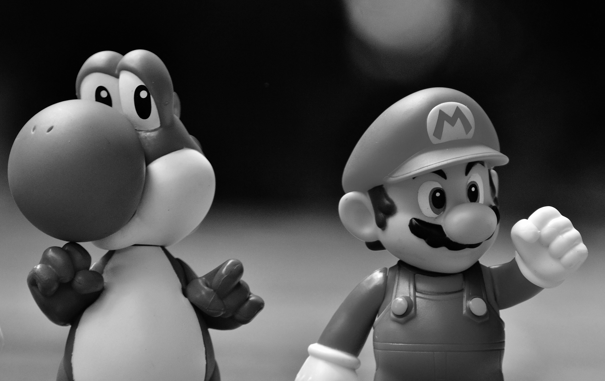
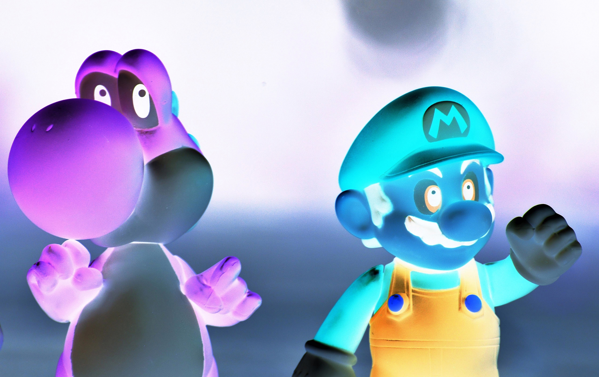
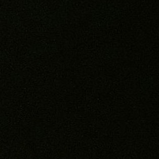
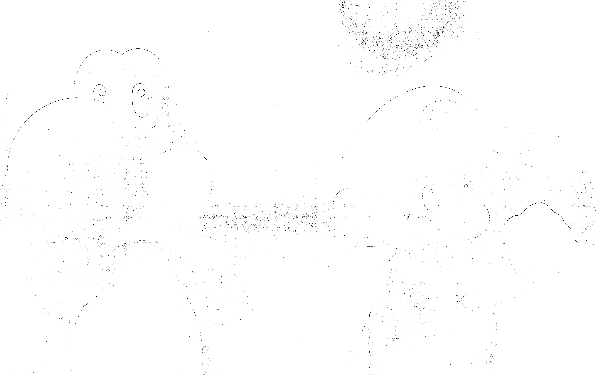
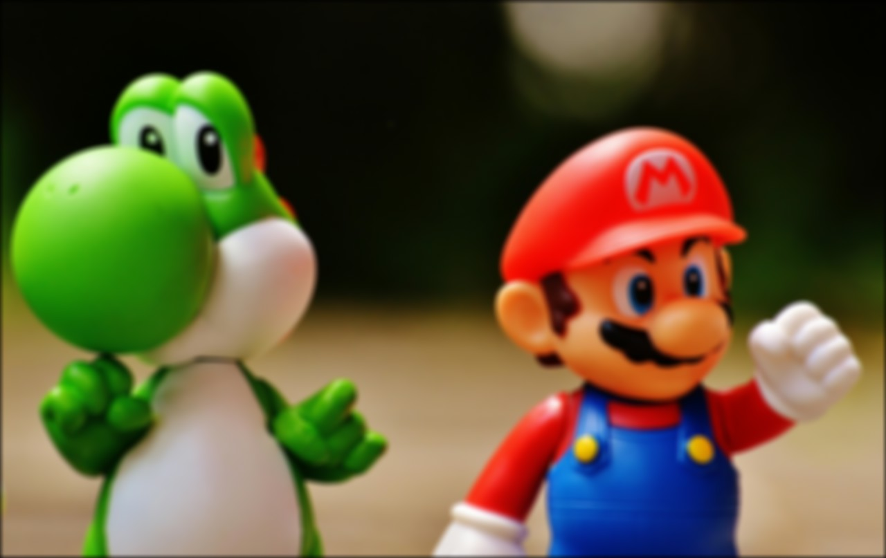

# Davinci – CS213 OOP Assignment 1

## Overview

Davinci is an image processing project developed as part of **CS213: Object-Oriented Programming** (Fall 2025–2026, FCAI Cairo University).
The system allows users to load images, apply a variety of filters, and save the results.
It is inspired by real-world tools like Photoshop, but implemented in C++ with pixel-level operations.

Our work is organized into modular functions, using the provided image library (`Image_Class.h`, `stb_image.h`, `stb_image_write.h`) for loading and saving images.
The filters themselves are built from scratch to practice array manipulation, C++ functions, and teamwork :).

---

## Features

* **Menu-driven interface** for loading, applying filters, and saving images
* Support for popular formats: `.jpg`, `.jpeg`, `.png`, `.bmp`
* Implemented filters (Hero Level, 12 filters):

1) Grayscale Conversion
  2) Black and White
  3) Invert Image
  4) Merge Images
  5) Flip Image
  6) Rotate Image
  7) Darken and Lighten
  8) Crop Image
  9) Add Frame
  10) Edge Detection
  11) Resize Image
  12) Gaussian Blur
  13) Sunlight Effect 
  14) Oil Painting
  15) Old TV Filter
  16) Red Tint
  17) Green Tint
  18) Infrared View
  19) Skewing Filter

---

## Team Members

**Team Name:** Davinci

* **Samir Kahlawy** – Filters 1, 4, 7, 10 + 15, 15, 17
* **Ziad M. Amer** – Filters 2, 5, 8, 11 + 18, 19
* **Ammen O. Ahmed** – Filters 3, 6, 9, 12 + 13, 14

---

## Video DEMO
[](https://www.youtube.com/watch?v=3NSFLYrcOfg)

**Please Like, Share and Subscribe :D**

---

## Project Structure

```
Davinci/
│
├── include/                  
│   ├── Image_Class.h
|   ├── menu.h
│   ├── stb_image.h
│   ├── stb_image_write.h
│   └── filters.h
│
├── src/                      
│   ├── main.cpp              
│   ├── filters.cpp
|   ├── stb_imeplementation.cpp        # Added to solve a discussed issue           
│   └── menu.cpp           
│
├── images/                   
│   ├── input/
│   │   ├── sample.jpg
│   │   └── test.png
│   └── output/
│       ├── sample_grayscale.jpg
│       ├── sample_invert.jpg
│       └── ...
│
├── docs/                    
│   ├── system_diagram.png
│   ├── contributions.txt
│   └── README.md
│
├── .gitignore
└── README.md
```

---

## How to Run

### Requirements

* C++ Compiler (g++, clang, or MSVC)
* Provided image library (`Image_Class.h`, stb headers)
* Any OS (Windows, Linux, macOS)

### Compilation (Linux/Mac example)

```bash
g++ src/main.cpp src/filters.cpp src/menu.cpp src/stb_implementation.cpp -I include -o davinci
```

### Running

```bash
./davinci
```

At program start, you will be asked to load an image.
The menu will then allow you to apply filters, save results, or exit.

---

## Usage Demo

Here are some example transformations produced by Davinci:

| Original (Input)                  | Grayscale Output                            | Inverted Output                            |
| --------------------------------- | ------------------------------------------- | ------------------------------------------ |
|  |  |  |

| Cropped Output                         | Edge Detection Output                    | Blur Output                            |
| -------------------------------------- | ---------------------------------------- | -------------------------------------- |
|  |  |  |


---

## GitHub Workflow

* **Private Repository** with branching strategy:

  * `main` → stable, working version
  * `samir-filters`, `ziad-filters`, `ammen-filters` → development branches
* Regular merges after testing
* Contributions tracked in `docs/contributions.txt`

---

## Deliverables

* **Part 1**: Menu + 6 filters (Oct 1, 2025)
* **Part 2 (Hero Level)**: 12 filters, GitHub repo, system diagram, video demo (Oct 10, 2025)
* **Part 3 (Winged Dragon Level)**: 20 filters + GUI, documentation, video demo, report (Oct 15, 2025)
---

## System diagram:


---

## Acknowledgments

* **Course Instructor:** Dr. Mohammad El-Ramly
* Provided libraries: `stb_image.h`, `stb_image_write.h`, and `Image_Class.h`
* FCAI Cairo University, CS213 OOP Programming, 2025–2026
